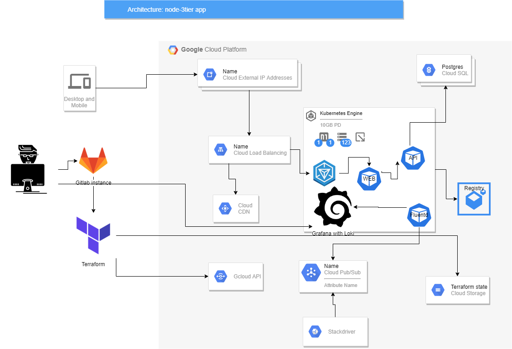

### Requirements

- Req: Create resources for all the tiers
  
  Solution: use terraform for declarative infrastructure management
- Req: The architecture should be completely provisioned via some infrastructure as a code tool.
  
  Solution: terraform is the main infra as code tool used in the project
- Req: Presented solution must handle server (instance) failures. 
  
  Solution: The architecture uses a regional k8s multi-zone cluster deployment
- Req: Components must be updated without downtime in service. 
  
  Solution: Application components are deployed with helm chart(s) and helm rollout ensure the service will not experience downtime
  
- Req: The deployment of new code should be completely automated (bonus points if you create tests and include them into the pipeline).
  Solution: Gitlab CI/CD pipeline is used to trigger the build of docker images, the test using local container and deployment to production using terraform

- Req: The database and any mutable storage need to be backed up at least daily.
  
  Solution: The database is provisioned as a Cloud SQL instance and set to have automated backup (daily)
- Req: All relevant logs for all tiers need to be easily accessible (having them on the hosts is not an option). 
  
  Solution: The following suite is installed and configured: Grafana Loki + fluent-bit + prometheus + promtail + postgres_exporter + node_exporter + fluentd with gcloud pubsub & loki plugin
- Req: Implement monitoring and logging using self-provisioned tools. Usage of managed services for monitoring/logging is not permitted.
  
  Solution: For non-managed components the fluent-bit & prometheus exporters are used to gather or expose logs and metrics while for managed components (database) the logs are retrieved using log sinks and gcloud pub/sub
- Req: You should fork the repository and use it as the base for your system.

  Solution: the code was added to initial repo
- You should be able to deploy it on one larger Cloud provider: AWS / Google Cloud / Azure / DigitalOcean / RackSpace. 
  
  Deployed on Google Cloud
- The system should present relevant historical metrics to spot and debug bottlenecks. 
  
  The following Grafana dashboards are implemented by default:
    + Postgresql Statistics
    + Postgresql Performance
    + Kubernetes
    + Node exporter
     
- The system should implement CDN to allow content distribution based on client location
  The GCP load balancers were configured to use CDN

### Processes

The deployment pipeline design was based on Gitlab pipelines for merge requests: https://docs.gitlab.com/ee/ci/merge_request_pipelines/ pattern.

The usual development workflow is: 
- create a feature/fix branch
- push changes to the feature/fix branch
- create a Merge Request from feature/fix branch to master
- select `Merge when pipeline succeeds` button

The pipeline will run the build of docker containers locally (using shell-exec runner - see README.md), push the images into Gcloud project registry, then will run the test using the docker runner.

The test consists in raising a container stack using Gitlab docker integration with all three tiers and testing the API and Web tiers.

The next step (if the build and test are successful) is to run the buid from master and the deployment.

The build stage for master push is very similar to the one for merge request and it was needed for two reasons: to make the pipeline work with direct push to master and because there is no clean way to pass information from one pipeline job to other.

The deploy stage is using Terraform to deploy or upgrade the project infrastructure.

Docker image tag for new images is a substring from commit SHA.

### Architecture

The following architecture was implemented:

### Terraform details

Since Gitlab caching is not caching always the changes (for example is the job is failing) we can't use a local file backend for Terraform.
Instead, GCS integration was used.

Terraform is managing all infrastructure items:

- Google SQL Postgresql instance, database and user
- Google Container Cluster (kubernetes)
- Helm charts for application and monitoring
- Kubernetes secrets
- Shell script for generation of .kubeconfig file and setup of docker credentials
- Network resources (Public IP for application exposure and Private IP for Postgres DB access)
- Google PubSub Topics
- Google service accounts (for sqlproxy and pubsub access)
- Postgresql user password (generated randomly)

### Solution API (what can be changed via parametrization)

The following items were parameterized in the deployment and may be overridden easily:

- name of the project (with one restriction: need to update also .gitlab-ci.yml since this file is not managed by TF)
- k8s workers flavor
- DB worker flavor
- number of k8s workers per zone
- Google gke_version
- google cloud region and zones
- database size
- database user name
- name of the database logging pubsub topic (where the database logs are gathered for consumption by fluentd)
- k8s cluster name (same restriction as for project)
- name of the sql-proxy service account
- name of the pubsub service account
- API and web components docker image tags
- override for promtail component config in loki-stack chart
- override for grafana component config in loki-stack chart
- override for prometheus component config in loki-stack chart

### Monitoring

The loki-stack helm chart (https://github.com/grafana/loki/tree/master/production/helm/loki-stack) was used for solution monitoring.
Several dashboards were added to grafana automatically.
Promtail was configured to parse the log of the Web component and change the service time for each request in a prometheus metric but some evolution of loki-stack is needed in order to activate the promtail service.
A much easier way would be to add monitoring instrumentation into the application.
Database metrics are gathered by an exporter running alongside the application (deployed with the same chart) and database logs are exposed with a Logging sink on Pubsub and consumed by fluentd with the following plugins:
fluent-plugin-gcloud-pubsub-custom and fluent-plugin-grafana-loki

### Helm charts

Three charts were used, one from community and two created specifically for this project:

- node-3tier - contains the API & Web application tier, the database prometheus exporter, the services and the ingress
- fluentd-gcloud - contains the special crafted fluentd meant to gather logs from Gcloud pubsub topic and push them to loki
- loki-stack - contains prometheus, grafana, promtail, fluent-bit, node-exporter, kube-state-metrics 

### Licensing

There weren't any requirements for licensing. Usually, the opensource tools and libraries used in this project conform to Apache2 license or GPL License.
If required, a license inventory can be conducted. 